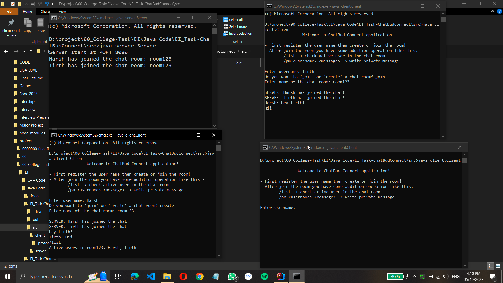
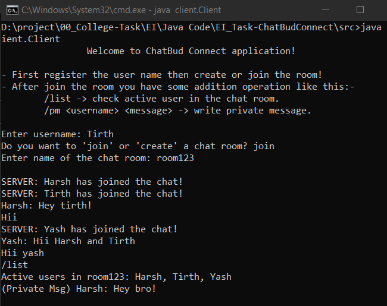
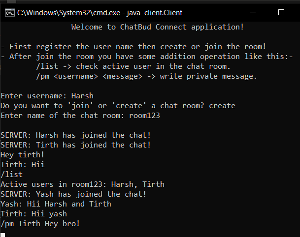
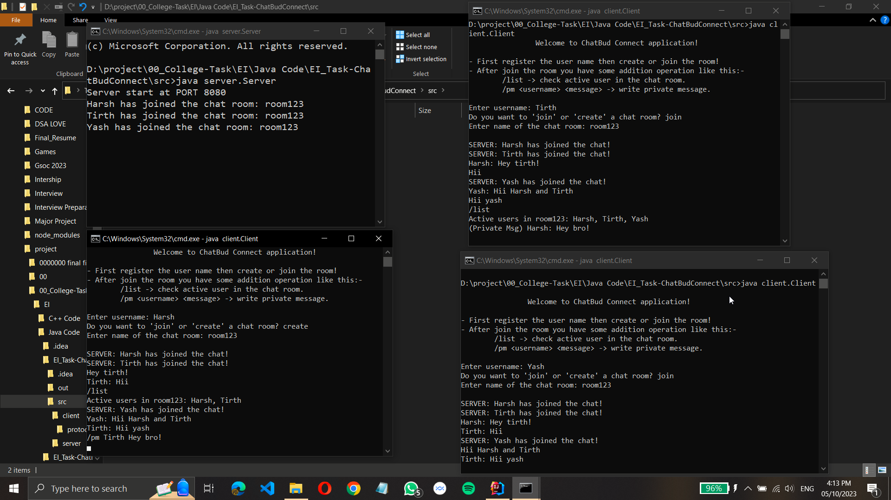

# Real-time Chat Application Programming Exercise using JAVA - "ChatBud Connect"


## Demo

To see a demo of this project, check out this [Live](https://youtu.be/7HEijyp9TJg). 
## 🌟 What's Inside?

- Real-Time Chat
- Create Chat-Room
- User can join or create multiple the chat rooms
- Private message system
- Active user list in the chat room
- Chat room chat history

## How to use feature in the chat room?

- /pm <username> <message>
    -
    eg. /pm Tirth Hello tirth? 
    Private message by Harsh as a user to Tirth

- /list
    -
    Find the active user list in chat room. 


## 🚀 Getting Started

1. Prerequisites: Ensure you have the Java Development Kit (JDK) installed on your machine.

2. Clone the Repository:

```bash
git clone https://github.com/HarshBaldaniya/EI-ChatApp-ChatBud_Connect.git
cd EI-ChatApp-ChatBud_Connect
```

3. Compile the Source Code:
```bash
javac server\*.java client\*.java client\protocols\*.java
```

4. Run the Server:
```bash
java server.Server
```

5. Run the Client:
```bash
java client.Client
```
Create mulltiple clients at same time also...
## 🛠 Built With

- Language: Java
- Networking: Java Sockets


## Screenshots







## 🔗 Links
[](https://www.harshbaldaniya.com/)
[](https://www.linkedin.com/in/hb134/)

